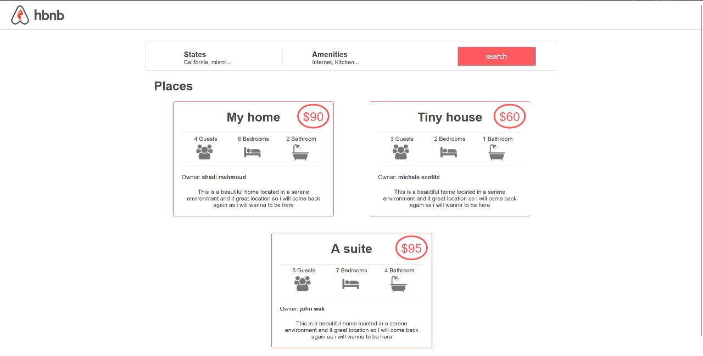
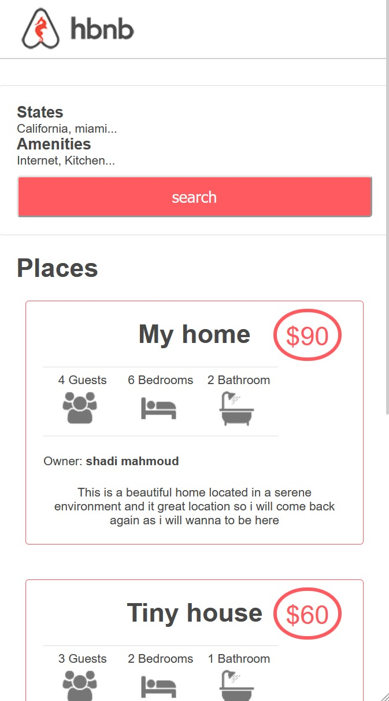

# AirBnB Console Application


## Project Overview

This project constitutes the initial phase of the AirBnB clone, focusing on backend development. It involves interfacing with a console application utilizing the cmd module in Python.

Data, represented as Python objects, are generated and stored in a JSON file, accessible via the json module in Python.

### Command Interpreter Description

The command interpreter resembles the Bash shell but offers a limited set of commands tailored for AirBnB website usage. Acting as the frontend of the web app, it facilitates interaction with the backend developed using Python's object-oriented programming.

Some available commands include:

- `show`
- `create`
- `update`
- `destroy`
- `count`

These commands enable various actions such as creating, retrieving, updating, and deleting objects.
## Simple UI for the HBNB

## responsive design

## Getting Started

Follow these instructions to set up a local copy of the project for development and testing purposes on a Linux distro.

### Installation

Clone the project repository from GitHub, which includes the main executable and its dependencies.

```bash
git clone https://github.com/Oxshady/AirBnB_clone_v3.git